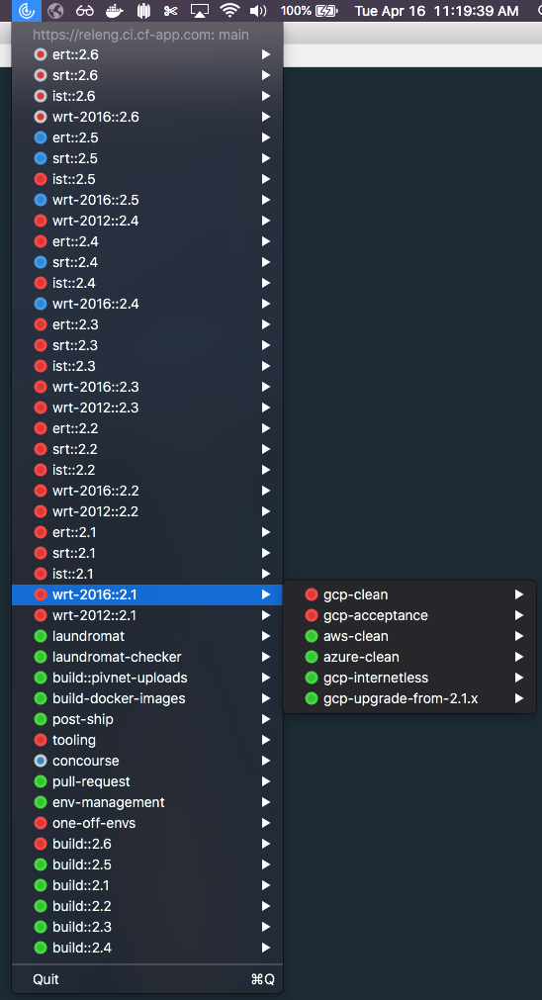

# Radar

A macOS taskbar icon that shows your Concourse pipelines; see the status and click through to view on Concourse!

<p align="center">

</p>

## Installation

You can `brew install` this with the following:
```
brew cask install ryanmoran/tools/radar
```

MacOS Sierra and higher has become much more strict about where
applications come from. In order to run `Radar`, you might need
to allow applications to be run from "Anywhere". To do this,
check out this
[article](http://osxdaily.com/2016/09/27/allow-apps-from-anywhere-macos-gatekeeper/).

To configure Radar to a Concourse instance, run the following
in Terminal:

`defaults write com.banana.Radar '{ targets = ( { api = "<YOUR-CONCOURSE-URL-HERE>"; team = main; } ); }'`
